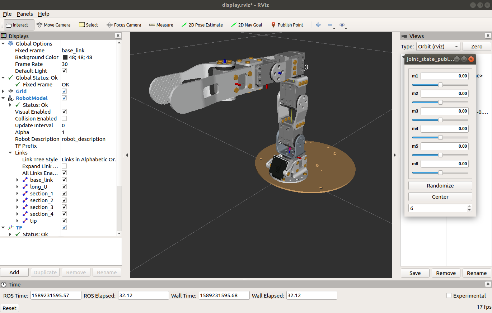

# Poppy Ergo Jr description

This ROS package contains URDF and collada files to use [Poppy Ergo Jr](https://www.poppy-project.org/en/robots/poppy-ergo-jr/) robot with ROS 1.
The URDF contains also contains the collision model and is suitable for Gazebo simulations. The package has been tested with Melodic and Noetic.



## Quickstart

Launch the following command in order to run RViz, visualize the robot and move the joints. If you want the lamp effector:
```
roslaunch poppy_ergo_jr_description display.launch gui:=True lamp:=true
```
Or, if you want the gripper effector:
```
roslaunch poppy_ergo_jr_description display.launch gui:=True gripper:=true
```

## Roadmap

Feel free to open pull requests!

* [ ] Integrate the pen holder effector to xacro 
